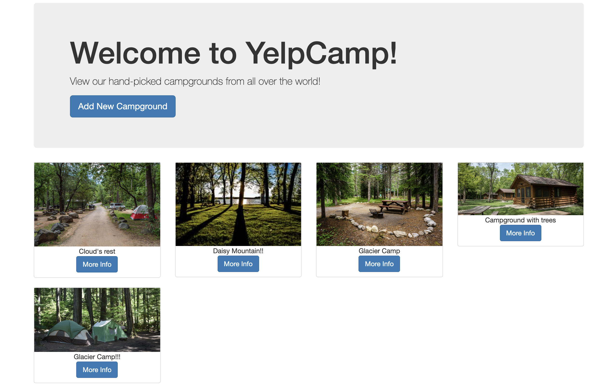

# YelpCamp
## Summary
This poject is a site for users to provide details about staying at different camp grounds. I created this while i was learning HTML, CSS, NodeJS, and MongoDB. This project taught me how to build a full stack web application. 

## Usage

When you open the application you will start on the landing page below:

Once you click on "View All Campgrounds" it will take you to the home page where you can then view campgrounds or create an account and add one yourself!

Home Page

## Architecture 

The pages in this app are built with HTML5, CSS3, JavaScript,and Bootstrap 4. I used jQuery, NodeJS, and ExpressJS to handle requests with MongoDB as my DB. Authentication with username and password store is used to ensure only the user can edit or delete campgrounds and comments.

## About

Everyone can create an account and then will be able create and review different campgrounds. Only users can modify their own campgrounds and comments after created.

## Running locally
Steps to run:
(insure you have mongo installed on yoru machine)
- Start the mongo damon : `mongod`
- run `npm install` to restore all the nessesary packages
- Inside the project directory type `node app.js` to start the project
- Open your URL and Port in a new browser

